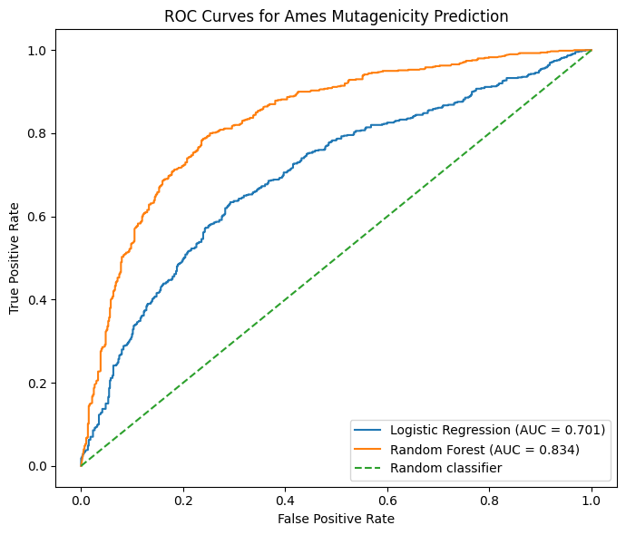
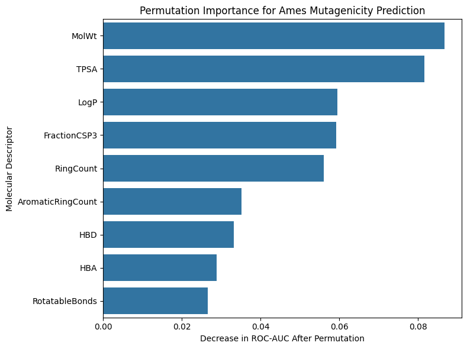

# Computational Analysis and Prediction of Ames Mutagenicity

**Author: Nadirah Begum**

A computational toxicology project investigating relationships between molecular properties and Ames mutagenicity and evaluating machine-learning approaches for binary mutagenicity prediction.

The dataset was originally published by Hansen et al. (2009) as a public benchmark dataset for the prediction of Ames mutagenicity and is distributed under a CC BY-NC 4.0 licence.

**Reference:** Hansen K, Mika S, Schroeter T, et al. *Benchmark Data Set for in Silico Prediction of Ames Mutagenicity.* Journal of Chemical Information and Modeling. 2009;49(9):2077–2081. doi:10.1021/ci900161g.

Dataset source: ACS Figshare, "Benchmark Data Set for in Silico Prediction of Ames Mutagenicity."

## Project Overview

The Ames test is widely used to assess whether chemical compounds have mutagenic potential. Computational approaches can complement experimental testing by identifying molecular characteristics associated with mutagenicity and by developing predictive models from chemical structure-derived information.

This project analyses 6,506 compounds using nine molecular descriptors calculated with RDKit. Statistical analysis was used to compare Ames-positive and Ames-negative compounds, followed by the development and evaluation of logistic regression and random forest classifiers.

## Objectives

- Calculate physicochemical and structural molecular descriptors from chemical structures.
- Compare molecular properties between Ames-positive and Ames-negative compounds.
- Quantify descriptor differences using statistical testing and effect sizes.
- Correct statistical comparisons for multiple testing.
- Develop logistic regression and random forest classifiers.
- Evaluate model performance using held-out test data and five-fold stratified cross-validation.
- Investigate molecular descriptor contributions using permutation importance.

## Dataset

The analysis uses the Hansen Ames mutagenicity dataset.

After molecular structure validation with RDKit, 6,506 compounds were retained for analysis:

- 3,497 Ames-positive compounds
- 3,009 Ames-negative compounds

Nine molecular descriptors were calculated:

- Molecular weight (MolWt)
- LogP
- Topological polar surface area (TPSA)
- Hydrogen-bond donors (HBD)
- Hydrogen-bond acceptors (HBA)
- Rotatable bond count
- Ring count
- Aromatic ring count
- Fraction of sp3-hybridised carbons (FractionCSP3)

## Methods

SMILES representations were converted into molecular objects using RDKit before descriptor calculation.

Descriptor distributions were compared between mutagenic and non-mutagenic compounds using two-sided Mann–Whitney U tests. Rank-biserial correlation was used to quantify effect size, and p-values were adjusted using the Benjamini–Hochberg false discovery rate procedure.

Two machine-learning models were evaluated:

1. Logistic regression as an interpretable linear baseline.
2. Random forest classification to model nonlinear relationships between molecular descriptors and Ames activity.

The dataset was divided into stratified 80% training and 20% testing sets. Model performance was evaluated using accuracy, precision, recall, F1-score and ROC-AUC. Five-fold stratified cross-validation was additionally performed for the random forest model.

## Results

| Model | Test Accuracy | Test ROC-AUC |
|---|---:|---:|
| Logistic Regression | 0.659 | 0.701 |
| Random Forest | **0.767** | **0.834** |

Five-fold stratified cross-validation of the random forest produced:

- Accuracy: **0.760 ± 0.007**
- ROC-AUC: **0.830 ± 0.005**
- F1-score: **0.778 ± 0.006**

The random forest therefore substantially outperformed the linear logistic regression baseline while maintaining similar performance across cross-validation folds.

### Molecular Descriptor Associations

All nine descriptors showed statistically significant differences between Ames-positive and Ames-negative compounds following FDR correction, although effect sizes varied.

The largest univariate effects were observed for:

- Aromatic ring count
- Total ring count
- FractionCSP3

Ames-positive compounds tended to have greater aromatic/ring character and lower sp3 character.

Permutation importance identified molecular weight, TPSA, LogP, FractionCSP3 and ring count among the most influential descriptors for random forest prediction.

## Model Performance



The nonlinear random forest model achieved substantially greater discrimination than logistic regression.

## Molecular Descriptor Importance



Permutation importance measures the reduction in held-out ROC-AUC after individual molecular descriptors are randomly shuffled.

## Limitations

This analysis uses nine relatively simple two-dimensional molecular descriptors and therefore does not explicitly represent detailed molecular substructures, functional groups, stereochemistry or three-dimensional molecular features.

A random train-test split was used. Structurally related compounds may therefore occur in both the training and test sets. Scaffold-based splitting would provide a more stringent assessment of model generalisation to novel chemical scaffolds.

Finally, Ames mutagenicity is a specific experimental endpoint and should not be interpreted as a comprehensive measure of human toxicity or carcinogenicity.

## Repository Structure

```text
ames-mutagenicity-analysis/
├── ames_mutagenicity_analysis.ipynb
├── data/
├── figures/
└── results/